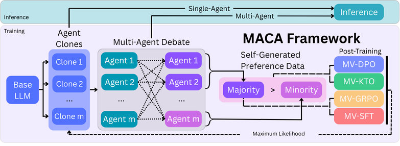

# MACA: Multi-Agent Consensus Alignment

*Internalizing Self-Consistency in Language Models through Multi-Agent Debate*



## Overview

MACA trains language models to be more consistent reasoners through multi-agent debate and consensus-based reinforcement learning.

**Key Features:**
- 🤖 **Multi-Agent Debate**: Orchestrate debates between agents for improved reasoning
- 🎯 **Consensus Training**: Post-train on debate outputs using agreement patterns as rewards
- ⚡ **Distributed Processing**: Multi-GPU parallel training with QLoRA adapters
- 📊 **Analysis Tools**: Built-in performance tracking and visualization

## Quick Start

### Installation

```bash
conda create -n maca python=3.12
conda activate maca
pip install -r requirements.txt
pip install -e .
```

### Multi-Agent Training

```bash
python main.py --model qwen2b --dataset gsm8k --gpus_per_model 1 --max_concurrent_tasks 4 --train_size 1500 --test_size 500 --lora_r 128 --lora_alpha 128 --dpo --epoch_dpo 3 --batch_dpo 6 --lr_dpo 1e-5 --beta_dpo 0.1 --gradient_accumulation_steps_dpo 4 --seed 1 --wandb
```

### Single-Agent Training

```bash
python maca_single_agent.py --output_dir q2b_sa_runs --model qwen2b --phase kto --kto --train_datasets math gsm8k mathqa --test_datasets math gsm8k mathqa svamp gpqa csqa --use_full_test --lora_r_range 64 --lora_alpha_range 64 --lr_kto 1e-5 --evaluation_batch_size 24 --wandb
```

### Key Arguments

- `--model`: Base model to use (mistral7b, llama1b/3b/8b, phi4b, qwen2b/7b, gemma4b)
- `--dataset`: Training dataset (gsm8k, math, gpqa, svamp, mathqa, csqa, arithmatic, aime_amc)
- `--agents`: Number of agents in the debate (default: 3)
- `--iterations`: Training iterations (default: 1)
- `--finetune`: Enable supervised fine-tuning (SFT)
- `--post_train`: Enable reinforcement learning post-training (GRPO)
- `--dpo`: Enable Direct Preference Optimization training
- `--kto`: Enable Kahneman-Tversky Optimization training
- `--use_consensus_reward`: Enable consensus-based rewards
- `--use_quantization`: Enable model quantization for memory efficiency
- `--use_scheduler`: Enable intelligent adapter scheduling (recommended)'

### Wandb logging

- `--wandb`: Enable Weights & Biases logging
- `--project_name`: W&B project name (default: llm-marl, requires setting --wandb)
- `--entity_name`: W&B entity/team name (default: llm-marl, requires setting --wandb)

## Project Structure

```
maca/
├── main.py                    # Main training entry point
├── maca_single_agent.py       # Single agent hyperparameter tuning and testing
├── model.py                   # Agent implementation and reward functions
├── debate.py                  # Multi-agent debate orchestration
├── orchestrator.py            # Training coordination and management
├── data.py                    # Dataset loading and preprocessing
├── parser.py                  # Answer parsing and grading utilities
├── args.py                    # Command-line argument definitions
├── utils.py                   # Utility functions and helpers
├── scheduler.py               # Dynamic job scheduling for adapters
├── train_agent_subprocess.py  # Subprocess training management
├── analyze_experiment_performance.py  # Debate results analysis
├── read_debate_performance.py # Read debate utils
├── data/                      # Dataset storage and splits
├── experiments/               # Experiment outputs and results
└── checkpoints/              # Model checkpoints and adapters
```

## Training Methods

Built on **Hugging Face TRL**, supports multiple paradigms with majority vote variants:
- **MV-SFT**: Supervised fine-tuning on consensus examples
- **MV-GRPO**: Reinforcement learning with consensus rewards  
- **MV-KTO/DPO**: Preference optimization methods

See `args.py` for complete argument documentation.

## Citation

This work was developed at Meta AI in collaboration with Meta Superintelligence Labs and the LIINC Lab at Columbia University.

If you use this framework in your research, please cite:

```bibtex
@misc{samanta2024maca,
  title={Internalizing Self-Consistency in Language Models: Multi-Agent Consensus Alignment},
  author={Ankur Samanta and Akshayaa Magesh and Youliang Yu and Runzhe Wu and Ayush Jain and Daniel Jiang and Boris Vidolov and Paul Sajda and Yonathan Efroni and Kaveh Hassani},
  year={2024},
  eprint={2509.15172},
  archivePrefix={arXiv},
  primaryClass={cs.AI},
  url={https://doi.org/10.48550/arXiv.2509.15172}
}
```